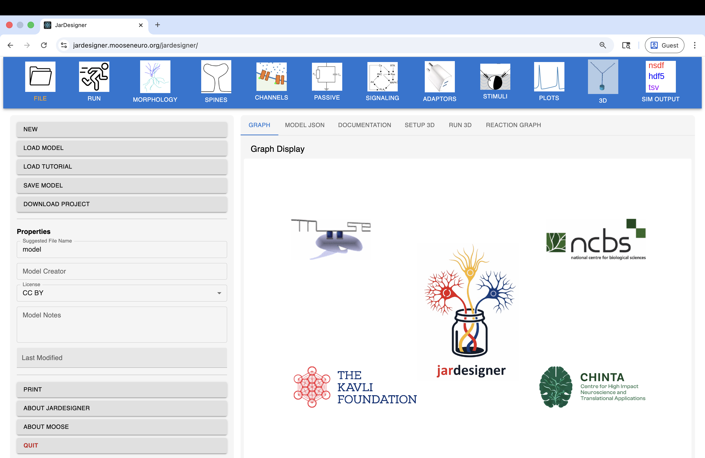

<div style="text-align: center;">
  
</div>

# Jardesigner

[](LICENSE)
[](https://www.python.org/)
[](https://reactjs.org/)
[](https://mooseneuro.org/)
[](https://github.com/MooseNeuro/jardesigner/issues)

<p>
  <a href="https://jardesigner.mooseneuro.org">🌐 Live App</a> &nbsp;|&nbsp;
  <a href="https://www.mooseneuro.org/docs/html/user/py/quickstart/qs_GUI.html">📖 Documentation</a> &nbsp;|&nbsp;
  <a href="https://pypi.org/project/pymoose/">🐍 PyMoose</a> &nbsp;|&nbsp;
  <a href="https://github.com/MooseNeuro/jardesigner/issues">🐛 Report a Bug</a> &nbsp;|&nbsp;
  <a href="https://github.com/MooseNeuro/jardesigner/discussions">💬 Discussions</a>
</p>

---

Jardesigner is a web-based GUI for building multiscale in neuroscience and systems biology. It enables users to interactively create and simulate computational models and visualize the results without any coding. Jardesigner provides easy access to builtin model components and several curated model databases. It provides 2D and 3D visualization of the model with animation and plotting of simulation results. The primary backend for Jardesigner is [MOOSE](https://mooseneuro.org/), the Multiscale Object Oriented Simulation Environment.



## Hosted Instance

A live hosted version is available at [jardesigner.mooseneuro.org](https://jardesigner.mooseneuro.org) — no installation required. The server infrastructure is managed by the [jardesigner-server](https://github.com/MooseNeuro/jardesigner-server) repository.

## Documentation

Full documentation including a GUI quickstart guide is available at [mooseneuro.org/docs/html/user/py/quickstart/qs_GUI.html](https://www.mooseneuro.org/docs/html/user/py/quickstart/qs_GUI.html).

## Features

### Model Building

Jardesigner provides dedicated panels for each aspect of a neuronal model:

- **Morphology** — import from SWC or NeuroML files, or build parametric single-compartment soma, ball-and-stick, or Y-branch models
- **Passive Properties** — configure Rm, Cm, Ra, Em, and initial Vm per compartment path
- **Ion Channels** — add voltage-gated and ligand-gated channels with placement rules across compartments
- **Dendritic Spines** — define spine head/shaft geometry and placement rules along dendrites
- **Chemical Models** — load reaction-diffusion networks from SBML or kkit (GENESIS-derived) format files
- **Adaptors** — couple electrical and chemical compartments bidirectionally (e.g. Ca²⁺ influx driving downstream signaling)
- **Stimuli** — apply current injection, voltage clamp, chemical field stimuli, or periodic/random synaptic inputs
- **Plots** — select quantities to record: voltage, currents, channel conductances, ion concentrations, signaling molecule levels

### Data Repository Integrations

Jardesigner connects directly to two major neuroscience databases:

- [NeuroMorpho.org](https://neuromorpho.org) — search and import reconstructed neuronal morphologies from the world's largest morphology repository
- [Allen Brain Cell Types Database](https://celltypes.brain-map.org) — browse cell types and import morphologies directly into the model

### Visualization

- **3D Morphology Viewer** — interactive visualization of neuronal structure with simulation animation overlay
- **Reaction Graph** — visualization of the loaded chemical reaction network
- **Simulation Plots** — plots of all recorded quantities against time

## Installation & Running Locally

Jardesigner requires two terminals running simultaneously — one for the backend and one for the frontend.

### Step 1 — Clone the repository

```bash
git clone https://github.com/MooseNeuro/jardesigner.git
cd jardesigner
```

### Terminal 1 — Backend

```bash
python -m venv venv
source venv/bin/activate        # On Windows: venv\Scripts\activate
pip install -r backend/requirements.txt
cd backend
python server.py
# → http://0.0.0.0:5000
```

### Terminal 2 — Frontend

```bash
cd frontend
npm install
npm run dev
# → http://localhost:5173
```

Open http://localhost:5173 in your browser. Both terminals must stay running.

### Running a simulation directly

From the repo root:

```bash
source venv/bin/activate
python launch_jardes.py <config.json>
```

## Contributing

If you are interested in contributing to the project:

1. Fork the repository on GitHub
2. Create a branch: `git checkout -b feature/your-feature-name`
3. Open a pull request against the `development` branch

For larger changes, open an issue first to discuss the approach.

## Bug Reports & Feature Requests

Please open an issue on the [GitHub issue tracker](https://github.com/MooseNeuro/jardesigner/issues).

When reporting a bug, please include:
- What you expected vs. what happened, and steps to reproduce
- Your browser, OS version
- The model JSON config if relevant — export via **File → Download Project**
- A screenshot of the Simulation Error dialog if one appeared

## Acknowledgements

Funded by [The Kavli Foundation](https://www.kavlifoundation.org/). Supported by [NCBS Bangalore](https://www.ncbs.res.in/) and [CHINTA](https://www.tcgcrest.org/institutes/chinta/).

## License

Jardesigner is available under the [GNU General Public License v3](LICENSE).
Copyright (c) Upinder S. Bhalla, NCBS, Bangalore, 2025.
